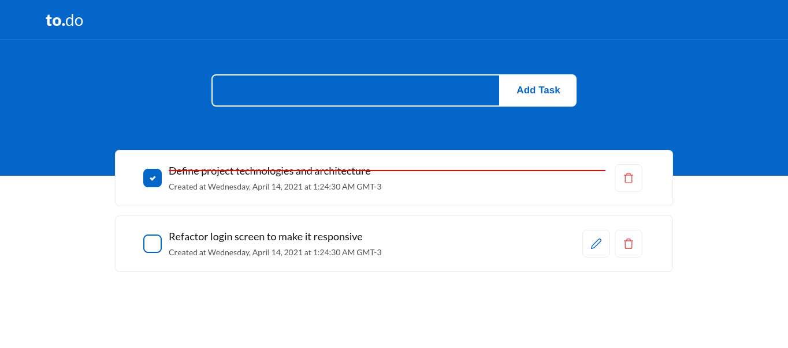

<div align="center">
  <h1>to.do list</h1>
  <p>
    Using the next.js feature to create backend and frontend
  </p>
  
</div>

Next.js version 10 now makes it possible to use Next.js itself to build backend. This is a very interesting feature because it means that Next.js can be used to create a frontend for data that is stored and retrieved by Next.js itself, transferring JSON via fetch requests.

In this project, both the frontend and the backend were built using only Next.js, it is possible to view the backend code in the `src/pages/api/` folder. everything in this directory is no longer React code and becomes Node.js code.

## Run project

Installs the dependencies

```
npm i
```

And to run the project run the command:

```
npm run dev
```
